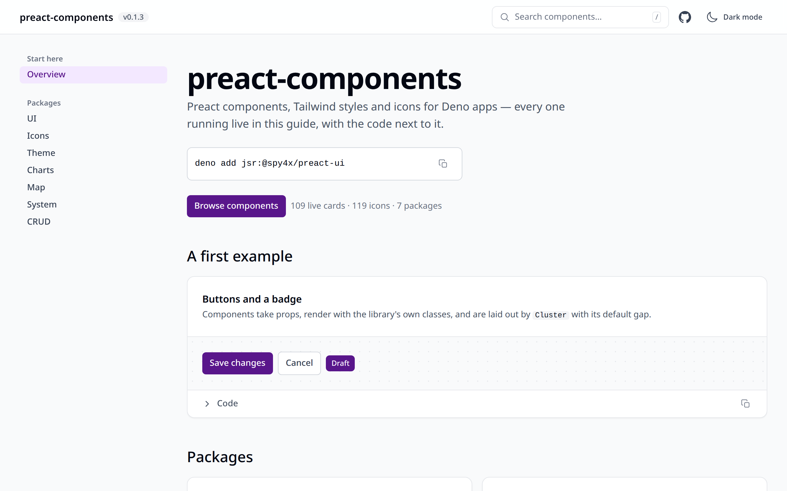

# preact-components

[](https://ci.antonshubin.com/repos/9)

Reusable Preact + Tailwind components, design tokens, icons and signals helpers for Deno apps.

Extracted from real products so the same button, table, chart and CRUD scaffold is written once.
The design system and the original markup are by [Eirene](https://github.com/Eirene)
([isorokina.com](https://isorokina.com/)) — see [Credits](#credits).

<picture>
  <source media="(prefers-color-scheme: dark)" srcset="docs/screenshots/guide-overview-dark.png">
  
</picture>

Live guide: https://spy4x.github.io/preact-components — every component running, with its code.

```bash
deno add jsr:@spy4x/preact-ui
```

## Status

Pre-1.0. Every package is published on JSR at `0.1.5` as `jsr:@spy4x/preact-<name>`, released
together from a `v*` tag by Woodpecker (#150) — see [`docs/publishing.md`](./docs/publishing.md).

No published file names a private application (#237). `deno task private-names <names-file>`
re-checks that against every package's dry-run file list, before each release tag is pushed — see
[`docs/pre-publish-checks.md`](./docs/pre-publish-checks.md).

## Install

Every package is published at the same version every time, so the caret range a package puts on
its siblings (`^0.1.N`) always resolves to the set published with it — see
[`docs/publishing.md`](./docs/publishing.md). Each package below installs on its own:

```bash
deno add jsr:@spy4x/preact-cn        # class-name join + Tailwind conflict resolution
deno add jsr:@spy4x/preact-icons     # merged icon set
deno add jsr:@spy4x/preact-signals   # stores and state helpers; no components
deno add jsr:@spy4x/preact-theme     # design tokens + Tailwind preset
deno add jsr:@spy4x/preact-charts    # server-rendered charts with tooltips
deno add jsr:@spy4x/preact-system    # app-level pieces: auth form, calendar, shells, SEO head
deno add jsr:@spy4x/preact-ui        # the component set
deno add jsr:@spy4x/preact-crud      # list and editor scaffold for one collection
deno add jsr:@spy4x/preact-map       # map on Leaflet (resolves leaflet)
deno add jsr:@spy4x/preact-ui-guide  # the live component catalogue, mounted in one line
```

Which package imports which sibling, read from the sources: `ui` imports `cn`, `icons` and
`signals`; `system` imports `cn`, `icons` and `ui`; `crud` imports `cn`, `icons`, `signals` and
`ui`; `map` imports `cn`; `ui-guide` imports every other package, for its catalogue.
`cn`, `icons`, `signals`, `theme` and `charts` import no sibling. JSR resolves a package's own
dependencies, so installing `ui` also resolves `cn`, `icons` and `signals` — none needs adding by
hand. `charts`, `crud`, `signals`, `system` and `ui` also import helpers from `spy4x/ts-libs`
(`@spy4x/platform`, `@spy4x/time`, `@spy4x/validation`), which JSR resolves the same way.

For the compiled Tailwind stylesheet — the tokens and design-system classes every component here
renders against — see [`theme/README.md`](./theme/README.md): JSR cannot export a CSS file
directly, so getting it is a short build-script recipe, not a plain `@import`.

## Usage

```tsx
import { Badge } from "@spy4x/preact-ui/badge"

<Badge text="Active" color="green" />
```

Every component's own README under the directories below lists its full prop surface.

The UI guide — the catalogue the demo site shows — is a component too. It has an overview and one
page per package, picked from a side navigation that becomes a dialog on a phone, and an app mounts
it in one line:

```tsx
import { uiGuideRoute } from "@spy4x/preact-ui-guide"

<uiGuideRoute.component />
```

Set `history.scrollRestoration = "manual"` in the host page, so a reload lands on what the address
names. [`ui-guide/README.md`](./ui-guide/README.md) has the props and the route grammar.

## Accessibility

Roles, labels, keyboard handling and focus are written by hand — this repository uses no
third-party component library — and proven in a real browser for the behaviours `pages/checks/`
covers; a package's own README says which behaviours that is. No screen reader has been run
against this repository (#210): what is demonstrated is markup and the order in which the DOM
changes, not what any assistive technology actually speaks.

## Credits

The design system, the component styling and the original markup in this repository come from
Eirene — https://github.com/Eirene, https://isorokina.com/. This repository turned that work into a
reusable Preact + signals package. See [`CREDITS.md`](./CREDITS.md).

## Screenshots

Taken from a local build of the demo site by `deno task --cwd pages screenshots`, in the headless
Chromium the browser checks use, at 1280×800 and twice the pixel density.


## Where it runs

Every module is a standard ES module, and nothing a package publishes calls a Deno-only API: the
files that do — build, generation and audit scripts such as `theme/generate.ts`,
`icons/provenance.ts` and `ui-guide/coverage.ts` — are listed under `publish.exclude` in their
package's `deno.json`. A component touches `window` or `document` only inside an effect or an event
handler, so it renders to HTML on a server (`preact-render-to-string`, which is how every test here
renders it) and hydrates in the browser. The browser APIs the components call are standard ones,
among them Clipboard, Geolocation, the Service Worker container, `localStorage`, the History API,
`IntersectionObserver` and `ResizeObserver`. Some are reached through a port the caller can replace,
with the browser's own as the default; others, such as the observers in `charts/` and the History
API in `signals/`, are called directly. Every request a component makes goes to an address the app
supplies: `Avatar`, `ImageGallery`, `Lightbox` and `ZoomableImages` load the image URLs they are
passed, `Map` loads Leaflet with a dynamic `import()`, which the app's own bundle resolves, and
fetches map tiles from the `tileUrl` it is given, and `SWUpdater` registers the service-worker
script it is given, which the browser downloads. No package calls Fetch, Streams or Web Crypto; data
arrives through props. The tests and the build run under Deno 2; running a published package under
Node or Bun through JSR's npm compatibility layer has not been tried.

## Scope

| Directory   | Contents                                                                                                                                                                                                                                                                                                  |
| ----------- | --------------------------------------------------------------------------------------------------------------------------------------------------------------------------------------------------------------------------------------------------------------------------------------------------------- |
| `theme/`    | CSS text (`TOKENS_CSS`, `PRESET_CSS`, opt-in dark `INK_CSS`), every class the components render (`COMPONENT_CLASSES`), the spacing scale (`SPACING_STEPS`, `SPACING_GAPS`, `findOffScaleSpacing`), and Vite plugins (`preactThemeCss`, `requireComponentCss`, `npmSpecifiers`, `NpmVersionMismatchError`) |
| `icons/`    | merged icon set: one component per glyph, all listed by the guide's icon gallery                                                                                                                                                                                                                          |
| `ui/`       | `Stack`, `Cluster`, `Grid`, `Page`, `Section`, `Badge`, `Button`, `Table`, `DataTable`, `Dropdown`, `Combobox`, `Modal`, `Tooltip`, `Toastr` — and the rest                                                                                                                                               |
| `system/`   | `AuthForm`, `Calendar`, `RailShell`, `SEOHead` + `head` store, `Shell`, `SiteHeader`, `StateInit`, `SWUpdater`                                                                                                                                                                                            |
| `charts/`   | server-rendered charts with browser tooltips (`LineChart`, `Bars`, `DonutChart`, `Kpi`), axis maths (`scales`)                                                                                                                                                                                            |
| `cn/`       | `cn()` — class-name join + Tailwind conflict resolution                                                                                                                                                                                                                                                   |
| `signals/`  | `buildModelStore`, `useUrlFilters`, `table-state`, `createThemeStore`, `createToastStore`, `patchSignal` — and the rest; no components                                                                                                                                                                    |
| `crud/`     | `CrudList`, `CrudEditor`, `AssociationEditor`, `DeletionValidation`, field rows                                                                                                                                                                                                                           |
| `map/`      | `Map` on Leaflet — its own package, so only an app that imports it resolves Leaflet                                                                                                                                                                                                                       |
| `ui-guide/` | live component catalogue: an overview and one page per package behind a side navigation (`UIGuide`, `uiGuideRoute`)                                                                                                                                                                                       |
| `pages/`    | demo app (GitHub Pages site and the browser checks under `pages/checks/`), not published                                                                                                                                                                                                                  |

## Rules

- **Preact + Tailwind only.** No React.
- **No third-party component library.** No shadcn, Radix, Headless UI, Material, Chakra, Ark UI or
  React Aria — and no vendored copies of them. Components are implemented here, on our own stack,
  with roles, labels, keyboard handling and focus written by hand. Nothing mechanical enforces this;
  review does, and CI does not check it. Full policy, allowed set and the exact limits of the check:
  [`docs/no-third-party-components.md`](./docs/no-third-party-components.md). What the policy rules
  out and why: [`docs/not-building.md`](./docs/not-building.md).
- **Props and ports, not global stores.** Components take what they need; they do not import an
  app's state singleton.
- **One spacing scale.** Padding, margin and gap use only the steps `0 px 1 2 3 4 6 8 12 16`, no
  component carries an outer margin, and a page is laid out with `Page`, `Section`, `Stack`,
  `Cluster` and `Grid` and their named gaps: [`docs/spacing.md`](./docs/spacing.md).
- **The icon gallery is the self-documenting piece** — a new icon appears in the catalogue with no
  maintenance.
- **MIT.**

## Relationship to other repos

- `spy4x/ts-libs` — framework-agnostic TypeScript, published on JSR as `@spy4x/*`. No workspace
  coupling: packages import `@spy4x/platform`, `@spy4x/time` and `@spy4x/validation` from JSR at
  one exact version, pinned in the root `deno.jsonc`.
- `spy4x/template` — the SaaS app template, imports both.

## Naming policy

Three repos, not a monorepo. Third-party dependencies publish at the exact versions pinned here,
and the lockfile is committed. Sibling packages publish as caret ranges, which is why every package
is released at one version — see [`docs/publishing.md`](./docs/publishing.md).

---

Made by Anton Shubin · [antonshubin.com/tools](https://antonshubin.com/tools)
